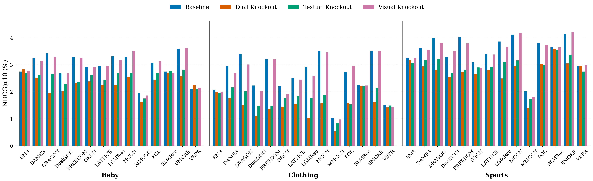

# [ECIR2026] Are Multimodal Embeddings Truly Beneficial for Recommendation? A Deep Dive into Whole vs. Individual Modalities
 
 
<a href="https://arxiv.org/abs/2508.07399" alt="arXiv"></a>
<a href="https://mp.weixin.qq.com/s/SYSzO_tZwBWmrLEnXutgiQ?scene=1" alt="中文博客"></a> 

## How to run the code
1. Prepare dataset, download files from Amazon, put files in ./dataset
2. Use .py files in ./preprocess to preprocess dataset
3. python src/main.py -m {model_name} -d {dataset_name}-{method} to train model, such as "python src/main.py -m FREEDOM -d Baby-baseline"

**If you encounter any questions or discover a bug within the paper or code, please do not hesitate to open an issue or submit a pull request.**

## Abstract
Multimodal recommendation has emerged as a mainstream paradigm, typically leveraging text and visual embeddings extracted from pre-trained models such as Sentence-BERT, Vision Transformers, and ResNet. This approach is founded on the intuitive assumption that incorporating multimodal embeddings can enhance recommendation performance. However, despite its popularity, this assumption lacks comprehensive empirical verification. This presents a critical research gap. To address it, we pose the central research question of this paper: Are multimodal embeddings truly beneficial for recommendation? To answer this question, we conduct a large-scale empirical study examining the role of text and visual embeddings in modern multimodal recommendation models, both as a whole and individually. Specifically, we pose two key research questions: (1) Do multimodal embeddings as a whole improve recommendation performance? (2) Is each individual modality - text and image - useful when used alone? To isolate the effect of individual modalities - text or visual - we employ a modality knockout strategy by setting the corresponding embeddings to either constant values or random noise. 

To ensure the scale and comprehensiveness of our study, we evaluate 14 widely used state-of-the-art multimodal recommendation models. Our findings reveal that: (1) multimodal embeddings generally enhance recommendation performance - particularly when integrated through more sophisticated graph-based fusion models. Surprisingly, commonly adopted baseline models with simple fusion schemes, such as VBPR and BM3, show only limited gains. (2) The text modality alone achieves performance comparable to the full multimodal setting in most cases, whereas the image modality alone does not. These results offer foundational insights and practical guidance for the multimodal recommendation community.

## Main Results

<p align="center" width="100%">

</p>

Comparing 14 Multimodal Recommendation Models under Modality Knockouts
on Baby, Clothing, and Sports Datasets.


## Citation
If you find our paper useful in your work, please cite our paper as:
```
@misc{ye2026multimodalembeddingstrulybeneficial,
      title={Are Multimodal Embeddings Truly Beneficial for Recommendation? A Deep Dive into Whole vs. Individual Modalities}, 
      author={Yu Ye and Junchen Fu and Yu Song and Kaiwen Zheng and Joemon M. Jose},
      year={2026},
      eprint={2508.07399},
      archivePrefix={arXiv},
      primaryClass={cs.IR},
      url={https://arxiv.org/abs/2508.07399}, 
}
```


## Join the GAIR Lab at the University of Glasgow

Our [**GAIR Lab**](https://gair-lab.github.io/), specializing in **generative AI solutions for information retrieval tasks**, is actively seeking **highly motivated Ph.D. students** with a strong background in **artificial intelligence**.

If you're interested, please contact **Prof. Joemon Jose** at [joemon.jose@glasgow.ac.uk](mailto:joemon.jose@glasgow.ac.uk).


<p align="center" width="100%">

</p>
